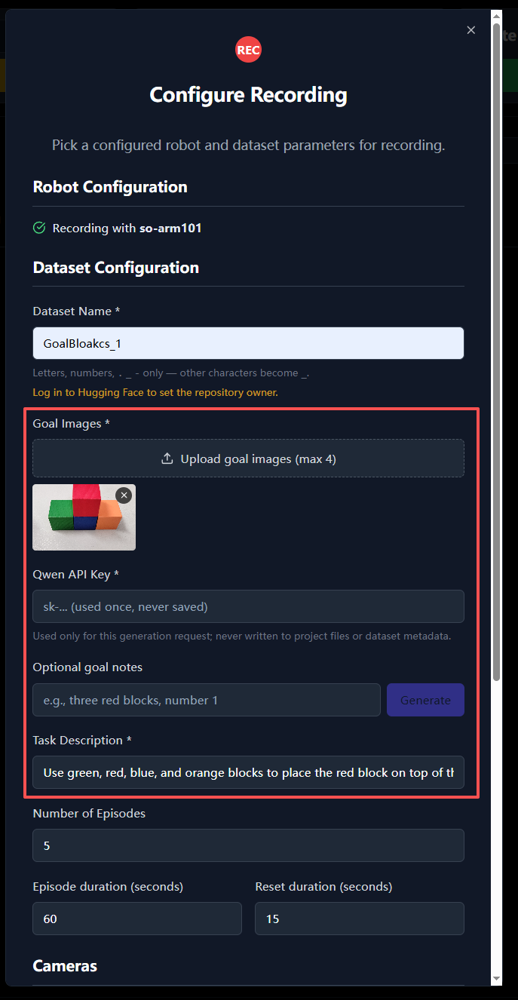

# LeLab GoalBlocks

An experimental, goal-conditioned SO-101 data collection and learning extension built on top of [Hugging Face LeLab](https://github.com/huggingface/LeLab) and [Hugging Face LeRobot](https://github.com/huggingface/lerobot).

This repository extends the LeLab recording interface with goal-image upload, optional Qwen-VL task-description generation, and persistent goal metadata. It also includes a compact GoalBlocks policy that consumes a goal image, natural-language task, two camera observations, and robot state to predict an SO-101 action chunk.

> **Unofficial derivative work:** this is an independent research prototype. It is not an official Hugging Face or LeRobot release and is not endorsed by Hugging Face.

## What Was Added

### Goal-aware LeLab recording



The recording dialog accepts goal images and can generate an editable task description before a demonstration begins.

- Upload one to four goal images while configuring a recording.
- Generate an editable task description from the goal image with Qwen-VL through DashScope.
- Keep the API key in memory for one request only; it is not written to project files or dataset metadata.
- Store goal images under `goals/` in the resulting LeRobot dataset.
- Persist the goal-image paths, task text, source, and language in `meta/info.json`, including partially completed recordings.

### GoalBlocks baseline

`goalblocks_baseline/` provides:

- balanced loading from multiple independent LeRobot dataset repositories;
- top camera, wrist camera, robot state, task text, and goal-image inputs;
- a lightweight goal-conditioned action-chunk model;
- episode-level train/validation splits, AMP, warmup plus cosine scheduling, gradient clipping, checkpointing, JSONL metrics, and resume support;
- a small remote inference server and a safety-oriented WSL robot client.

The baseline has **738,432 parameters (0.74M)**. A comparable two-camera, six-state/six-action LeRobot ACT configuration has approximately **51.55M parameters**, about **69.8 times more**. This baseline is intended to validate the complete pipeline, not to replace ACT or represent the final planned architecture.

### Released Checkpoint

The early experimental checkpoint, training configuration, metrics, dataset index, and goal-aware recording screenshot are available on Hugging Face:

[bmnzyb/goalblocks-so101-baseline](https://huggingface.co/bmnzyb/goalblocks-so101-baseline)

This checkpoint was trained only to validate the end-to-end pipeline and must not be treated as a reliable or production-ready robot policy.

## Datasets

The initial experiment uses two separately hosted LeRobot datasets:

| Dataset | Episodes | Modalities | Notes |
| --- | ---: | --- | --- |
| [`bmnzyb/GoalBloakcs_1_20260906_155729`](https://huggingface.co/datasets/bmnzyb/GoalBloakcs_1_20260906_155729) | 3 | top RGB, wrist RGB, 6D state/action, task, goal image | The top camera contains corrupted/torn frames. |
| [`bmnzyb/GoalBloakcs_1_20260906_162409`](https://huggingface.co/datasets/bmnzyb/GoalBloakcs_1_20260906_162409) | 2 | top RGB, wrist RGB, 6D state/action, task, goal image | Very small validation dataset. |

The same information is available in [`datasets.json`](datasets.json). These five episodes are enough to test the software path, but not enough to claim reliable task performance.

We welcome collaborators who would like to collect more goal-conditioned SO-101 demonstrations: different block arrangements, camera placements, lighting conditions, objects, successes, and recoveries are all valuable. Please open an issue or pull request with a dataset link and a short description of its hardware and collection setup.

## Quick Start

Install LeLab from this checkout using its normal development instructions. The editable install ensures the `lelab` command loads this source tree:

```bash
uv tool install --editable .
lelab --no-open
```

Open `http://localhost:8000`, configure the robot and cameras, then use the Goal Images section in the recording dialog. The generated description remains editable before recording begins.

Formal training in the existing LeRobot environment:

```bash
CUDA_VISIBLE_DEVICES=2 python -m goalblocks_baseline.train \
  --device cuda:0 \
  --steps 10000 \
  --batch-size 16 \
  --output-dir /workspace/outputs/goalblocks_baseline_formal
```

Remote inference instructions, including the default no-action dry-run, are documented in [`goalblocks_baseline/README.md`](goalblocks_baseline/README.md).

## Security and Robot Safety

- Never commit Qwen, Hugging Face, GitHub, or SSH credentials.
- The remote robot client does not send actions unless `--execute` is explicitly supplied.
- A successful network or software test does not establish that a learned policy is safe.
- Clear the workspace, keep an operator near the emergency power control, validate camera and joint ordering, and run the dry-run before every hardware deployment.
- The included model was trained on only five episodes and must be treated as an experimental pipeline artifact, not a production robot controller.

## Attribution, Copyright, and License

This repository contains and modifies code from:

- [Hugging Face LeLab](https://github.com/huggingface/LeLab), the upstream application and the base Git history for this repository.
- [Hugging Face LeRobot](https://github.com/huggingface/lerobot), whose dataset, robot, camera, and policy interfaces are used by the extension; portions of the integration follow LeRobot APIs and conventions.

The upstream projects are distributed under the **Apache License 2.0**. This derivative repository retains the upstream `LICENSE`, copyright headers, and attribution. Modified files and newly added GoalBlocks components are identified by the Git history and summarized in [`NOTICE`](NOTICE).

Apache-2.0 permits use, modification, and redistribution subject to its terms. Attribution does not transfer ownership of upstream code, imply endorsement, or remove any license obligations. Downstream users must preserve applicable copyright, license, and notice text and should review the licenses of dependencies, model providers, and datasets separately.

Unless a file states otherwise, contributions made specifically to this derivative repository are offered under Apache-2.0 to remain compatible with the upstream project.

## Status

This is early research software. Goal-image persistence and the baseline pipeline have automated tests, but the first top camera produced corrupted JPEG frames, and the released training run was intentionally stopped early. See the model card for exact training status and limitations.
